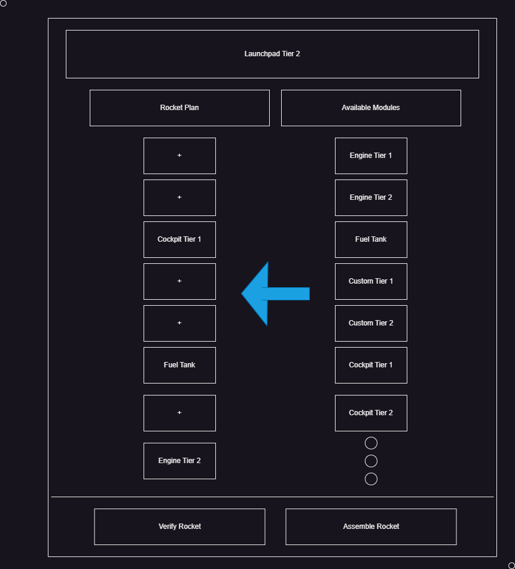

# Launchpad

### General Info

The launchpad is a multiblock that is being developed by Epix7 that aims to be a controller for the rocket assembly process.

There are different ways we can go about rocket assembly, but the idea I like the most is here:

## Assembly GUI

I think an Assembly GUI is ideal for rocket planning and preventing errors. Basically you move the modules from the "Available Modules" list into the "Rocket Plan".

## Available modules

- Here we can find all available modules for a certain launchpad tier, including all modules from a lower tier. This list is also filtered by module dimensions, as they cant fit on a launchpad that is smaller. 
- This has to be a scrollable list, as the amount of modules can easily exceed those that fit on the screen.

## Rocket plan

- You can freely move modules into your rocket plan.
- The slot quantity that is available to the player depends on the launchpad tier. (Or can be very large and scrollable, as the amount of modules will still be checked on verification).

## Verify Rocket

Pressing this button the following will happen:
- The amount of modules will be checked, inluding the max amount of every specific module. (unless we make the weight system, in that case we compare sum(weights) == max_weight).
- The required modules will be checked. If we dont have every required module, the process will fail.
- The order of the modules will be checked. Some modules must be on top or next to other specific modules. Cant have an engine on top of the cockpit :)

If all these checks are passed, then the player will see a success message saying that the rocket is ready to be assembled.
- Note: changing anything on the UI will reset the verification

## Assemble Rocket

Pressing this button **before** verification:
- The verification process will be executed normally and if successful, the assembly will start. (see below for process)

Pressing this button **after** verification:
- It will require a rocket controller in an input hatch on the launchpad
- The rocket controller will be auto-placed on the cockpit (floating in the air) and a hologram of the full rocket will be displayed as a regular multiblock. 
- Players will have to build the multiblock normally and the structure will be valid only if the blocks placed correspond to those specified on the JSON files of each module.
