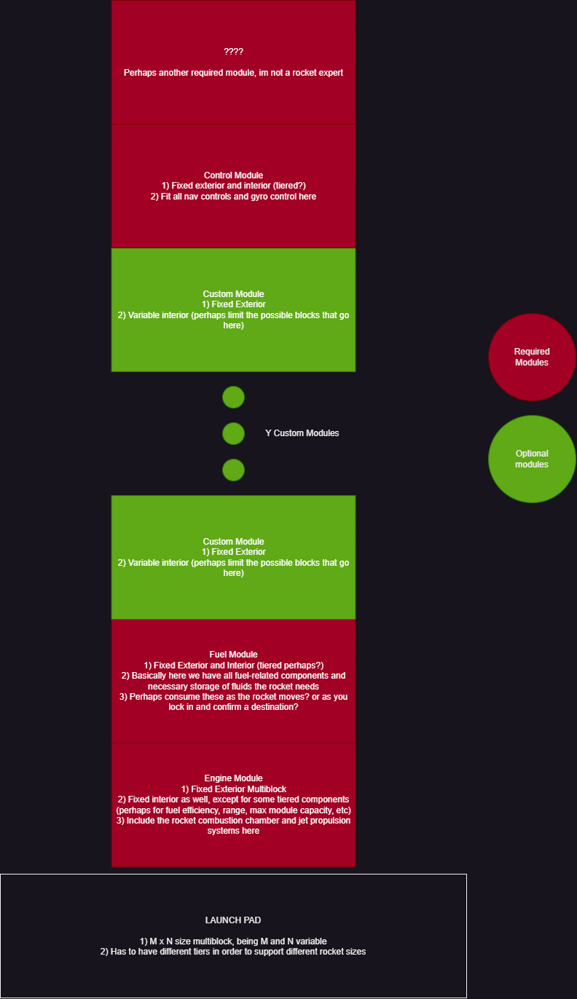

# Rocket

### General Idea

Rockets are multiblocks composed by [Modules](Module.md). Each rocket **is required to have** X required modules and **can** have Y custom/optional modules.

NOTE: MORE INFO WILL BE ADDED HERE WHEN AVAILABLE

## 1. Rocket 

About rocket assembly process: [read here](Launchpad.md)

Basic rocket diagram:

## 2. Functionality

To be defined